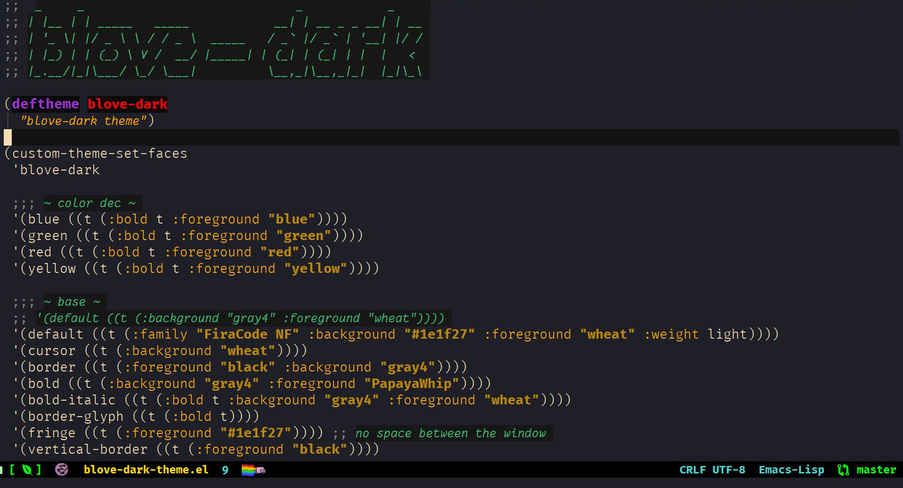
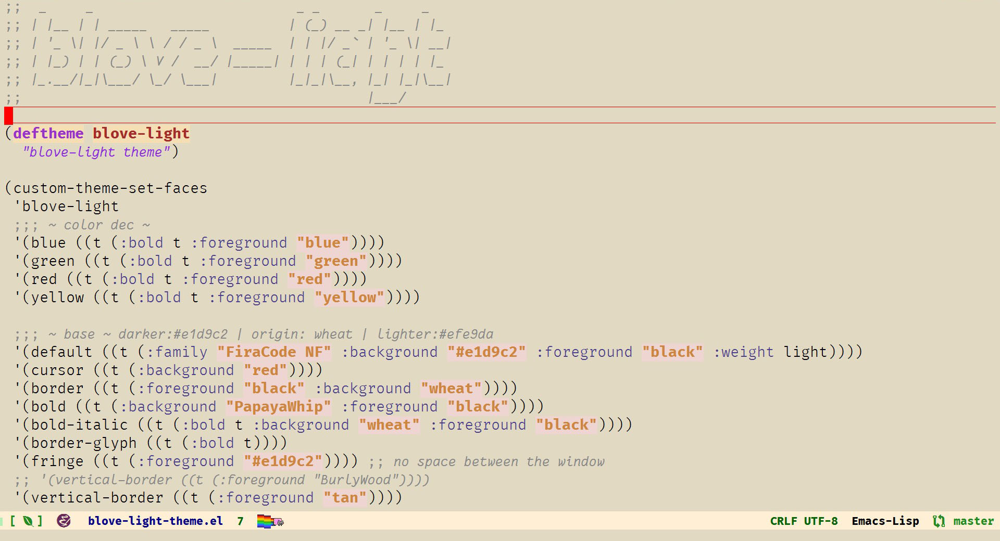

# About blove-theme-emacs

### There are two variants of the theme:

#### - blove-dark-theme for emacs



#### - blove-light-theme for emacs



# How to use it

### 1 - Download it anywhere (eg : ~/.emacs.d)
### 2 - Adding the "blove-theme" directory to the list in your init file (init.el):
```
(add-to-list 'custom-theme-load-path (expand-file-name "path/blove-theme"))
```
### 3 - To use it put the following in your init.el
##### blove-dark
```
(require 'blove-dark-theme)
(load-theme 'blove-dark t)
```
##### blove-light
```
(require 'blove-light-theme)
(load-theme 'blove-light t)
```
